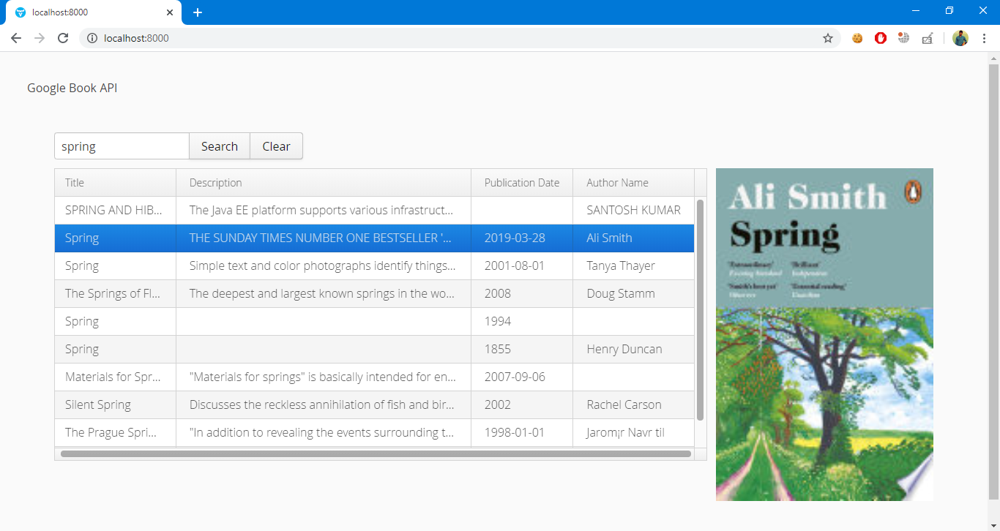

## Google Book Search UI using Vaadin

Application above use Vaadin, Spring Boot and google book search api to search for the book and display in the tabular form.

Used Url https://www.googleapis.com/books/v1/volumes?q= to fetch google book search result in the form of json where `q` takes name of the book you want to search.

